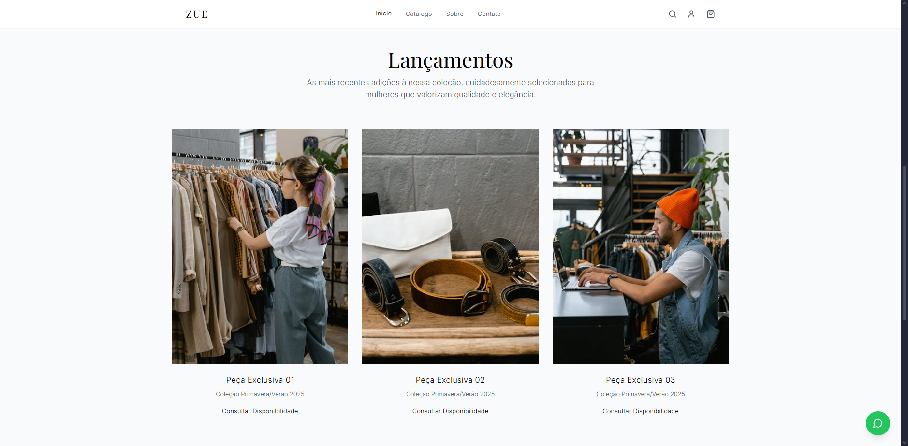

# Zue - Elegância Atemporal

Website e vitrine digital da marca de moda **Zue**. Desenvolvido com **React**, **TypeScript** e **Vite**, com interface minimalista e responsiva em **Tailwind CSS v4**. O mesmo código-fonte gera um **app Android** (tablet na loja) via **Capacitor 8**.



## Sobre o Projeto

O site funciona como vitrine da marca no tablet da loja (e na web, mesmo código):

- **Início** — landing com hero, lançamentos e valores da marca
- **Catálogo** — intro de marca + carrosséis empilhados (1ª coleção em destaque); deslize navega, toque expande fullscreen (autoplay nos visíveis + barra de progresso)
- **Sobre** — história, valores e políticas da loja
- **Hibernação** — após 2 min sem toque (2 s em DEV): composição tipográfica ZUE + tagline; ao interagir, retoma de onde parou
- **Pasta de mídia** — pasta Drive sync; subpastas = coleções; ordenação nome/data; long-press na logo ZUE

Sem checkout, WhatsApp ou CTAs de conversão.

Na loja física, a mesma interface roda em tablet Android em modo vitrine (tela cheia / kiosk), reaproveitando animações, componentes e o fluxo de manutenção web.

## Specs (Cursor) — vivas

A especificação acompanha o estado real do repositório (não é documento congelado):

| Formato | Caminho | Uso |
|--------|---------|-----|
| **Rule** (resumo) | [`.cursor/rules/zue-spec.mdc`](.cursor/rules/zue-spec.mdc) | Contexto curto, sempre aplicado ao agente |
| **Skill** (detalhada) | [`.cursor/skills/zue-spec/SKILL.md`](.cursor/skills/zue-spec/SKILL.md) | Guia completo: arquitetura, design, Capacitor/kiosk, convenções |

Em mudanças de produto/stack, atualizar rule + skill + README na mesma entrega. Validar alinhamento:

```bash
node .cursor/hooks/check-spec-drift.mjs
```

Consulte a skill ao implementar features, mudar UI ou trabalhar no app Android.

## Tecnologias

- **[React](https://react.dev/)** — interface
- **[TypeScript](https://www.typescriptlang.org/)** — tipagem
- **[Vite](https://vitejs.dev/)** — build e dev server
- **[Tailwind CSS v4](https://tailwindcss.com/)** — estilização
- **[shadcn/ui](https://ui.shadcn.com/)** — componentes (`radix-nova`)
- **[Lucide React](https://lucide.dev/)** — ícones
- **[Capacitor 8](https://capacitorjs.com/)** — app Android a partir do build web
- **[Lenis](https://github.com/darkroomengineering/lenis)** — smooth scroll (somente web)
- **ESLint** — qualidade de código
- **Vitest** — testes unitários (`utils`, `app-update`, `media-types`, `motion`)
- **GitHub Actions** — CI de validação, deploy GitHub Pages e release de APK
- **Capacitor plugins** — Filesystem, Preferences, File Picker (Capawesome), StatusBar, Keep Awake, App

## Pré-requisitos

- [Node.js](https://nodejs.org/en/) 18+
- npm
- Para o app Android: [Android Studio](https://developer.android.com/studio), SDK Android e JDK 17 ou 21

## Instalação e execução (web)

```bash
git clone <url-do-seu-repositorio>
cd zue
npm install
npm run dev
```

O terminal mostra a URL local (em geral `http://localhost:5173/`).

## App Android (vitrine / kiosk)

Identidade: `br.com.zue.vitrine` · nome **Zue**.

Ícone da marca: monograma **Z** (Didone / preto e branco) em `resources/icon.png`, propagado para favicon web, PWA e launcher Android. Regenerar com `npm run icons:generate` após trocar o master.

Comportamento no tablet:

- Tela cheia (barras do sistema ocultas)
- Tela permanece ligada
- Hibernação após 2 min sem interação (2 s em DEV; wordmark ZUE + tagline)
- Catálogo em página imersiva com carrosséis (destaque + secundários); expand fullscreen (foto 5 s; vídeo = duração + poster)
- Pasta de mídia selecionável (long-press na logo ZUE no Header, seção catálogo)
- Ao abrir, verifica em background se há nova **GitHub Release** e oferece atualizar o APK

### Pasta de mídia (gerente / Google Drive)

O catálogo pode usar arquivos reais da loja em vez dos slides de demonstração.

1. No Google Drive, crie uma pasta (ex.: `Zue Vitrine`) e coloque fotos/vídeos nela
2. **Opcional:** crie **subpastas** (ex.: `Primavera`, `Editorial`) — cada uma vira uma coleção no app; arquivos na raiz formam a coleção com o nome da pasta
3. No tablet (ou PC), sincronize essa pasta com o app **Google Drive** (disponível offline / pasta espelhada)
4. Abra o catálogo na Zue e **pressione a logo ZUE por ~1 segundo**
5. Em **Mídia da vitrine** → **Selecionar pasta** e escolha a pasta sincronizada
6. Novos arquivos: envie pelo Drive de qualquer dispositivo; no tablet use **Atualizar pasta** (mesmo long-press)
7. **Ordenação:** no sheet, escolha Nome ou Data (preferência salva no dispositivo)

Formatos: `jpg`, `jpeg`, `png`, `webp`, `gif`, `mp4`, `webm`, `mov`, etc.

Web: Chrome/Edge com File System Access API (blobs sob demanda). Android: seletor nativo (SAF) via Capawesome.

```bash
npm run cap:sync      # build web + sync no projeto android/
npm run cap:open      # abre no Android Studio
# ou
npm run cap:android   # sync + abre o Studio
```

No Android Studio: rode no tablet ou **Build → Build Bundle(s) / APK(s)**.

### Atualização automática (tablet)

O app consulta a latest release do repositório (`GuilhermeRoesler/Zue`), compara a tag com a versão instalada e, se houver APK mais novo, exibe um diálogo para baixar e instalar. Na primeira vez o Android pode pedir permissão para “instalar apps desconhecidos”.

Arquivos: `src/lib/app-update.ts`, `src/components/UpdatePrompt.tsx`, `android/.../ApkUpdaterPlugin.java`.

### CI/CD (GitHub Actions)

#### Validação (push / PR)

O workflow [`.github/workflows/ci.yml`](.github/workflows/ci.yml) roda em push e pull request nas branches `main`/`master`:

1. ESLint (`npm run lint`)
2. TypeScript (`npm run typecheck`)
3. Testes unitários Vitest (`npm run test`)
4. Build de produção (`npm run build`)
5. Alinhamento das specs vivas (`check-spec-drift`)

Localmente, o mesmo pipeline: `npm run ci`.

#### GitHub Pages (vitrine web)

O workflow [`.github/workflows/github-pages.yml`](.github/workflows/github-pages.yml) faz o build Vite e publica o `dist/` no **GitHub Pages** a cada push em `main`/`master` (também via *Run workflow*).

1. Em **Settings → Pages**, defina **Source: GitHub Actions** (uma vez)
2. Após o deploy, o site fica em `https://guilhermeroesler.github.io/Zue/`
3. O `base: './'` do Vite serve Capacitor e o Pages (assets relativos); `public/.nojekyll` evita o Jekyll

#### Release APK (tags `v*`)

O workflow [`.github/workflows/android-release.yml`](.github/workflows/android-release.yml) gera um **APK release assinado** e publica em uma **GitHub Release** ao criar uma tag `v*` (ex.: `v1.0.0`).

##### 1. Gerar o keystore (uma vez)

Com JDK instalado:

```bash
keytool -genkeypair -v -keystore zue-release.keystore -alias zue \
  -keyalg RSA -keysize 2048 -validity 10000
```

Guarde o arquivo e as senhas em local seguro (não commitar).

##### 2. Secrets no GitHub

Em **Settings → Secrets and variables → Actions**, crie:

| Secret | Conteúdo |
|--------|----------|
| `ANDROID_KEYSTORE_BASE64` | Keystore em Base64 |
| `ANDROID_KEYSTORE_PASSWORD` | Senha do keystore |
| `ANDROID_KEY_ALIAS` | Alias (ex.: `zue`) |
| `ANDROID_KEY_PASSWORD` | Senha da chave |

Base64 (PowerShell):

```powershell
[Convert]::ToBase64String([IO.File]::ReadAllBytes("zue-release.keystore")) | Set-Clipboard
```

Base64 (Linux/macOS):

```bash
base64 -i zue-release.keystore | pbcopy   # ou xclip / só imprimir
```

##### 3. Publicar

```bash
git tag v1.0.0
git push origin v1.0.0
```

1. Aguarde a Action da tag concluir
2. Abra **Releases** e baixe `zue-v1.0.0.apk`
3. Instale no tablet (sideload; ainda pode pedir “fonte desconhecida”)

`versionName` vem da tag; `versionCode` é calculado (ex.: `1.2.3` → `10203`). Build local com Android Studio continua opcional (`android/key.properties.example`).

## Scripts

- `npm run dev` — servidor de desenvolvimento
- `npm run build` — build de produção em `dist/`
- `npm run preview` — preview do build
- `npm run lint` — ESLint
- `npm run typecheck` — verificação TypeScript
- `npm run test` — testes unitários (Vitest)
- `npm run test:watch` — Vitest em modo watch
- `npm run ci` — pipeline local (lint + typecheck + test + build + spec-drift)
- `npm run icons:generate` — gera favicons/PWA + mipmaps Android a partir de `resources/icon.png`
- `npm run cap:sync` — build + sync Capacitor Android
- `npm run cap:open` — abre Android Studio
- `npm run cap:android` — sync + abre Android Studio

## Estrutura

```text
src/
├── components/           # Seções e UI da vitrine
│   ├── ui/               # Primitivos shadcn (incl. carousel)
│   ├── About.tsx
│   ├── CatalogPage.tsx
│   ├── CatalogPlayer.tsx
│   ├── CustomCursor.tsx
│   ├── Footer.tsx
│   ├── Header.tsx
│   ├── Hero.tsx
│   ├── HibernateOverlay.tsx
│   ├── MediaFolderSheet.tsx
│   ├── Reveal.tsx
│   ├── TextReveal.tsx
│   └── UpdatePrompt.tsx
├── data/
│   └── catalog-slides.ts
├── hooks/
│   ├── use-catalog-slides.ts
│   ├── use-idle.ts
│   └── use-lenis.ts
├── lib/
│   ├── app-update.ts     # Checagem GitHub Releases (Android)
│   ├── app-update.test.ts # Vitest: compareSemver
│   ├── apk-updater.ts    # Bridge do plugin ApkUpdater
│   ├── idle-config.ts    # Timeout idle (2 min / 2 s em DEV) e slide de imagem (5 s)
│   ├── kiosk.ts          # StatusBar + KeepAwake + isNativeApp()
│   ├── media-folder.ts   # Pick/restore pasta (web + Android)
│   ├── media-types.ts    # Extensões → slides
│   ├── media-types.test.ts
│   ├── motion.ts         # Gates Lenis / cursor / reduced-motion
│   ├── motion.test.ts
│   ├── utils.ts          # cn() — clsx + tailwind-merge
│   └── utils.test.ts     # Vitest: cn
├── App.tsx               # Navegação por seções (estado)
├── index.css             # Tema Tailwind v4 + tokens
└── main.tsx

android/                  # Projeto nativo Capacitor
capacitor.config.ts
resources/
└── icon.png              # Master do ícone (1024²) → web + Android
scripts/
└── generate-icons.mjs    # Pipeline de ícones (sharp)
.github/workflows/
├── ci.yml                # Lint, typecheck, test, build, spec-drift
├── github-pages.yml      # Deploy do dist/ no GitHub Pages
└── android-release.yml   # APK assinado em tags v*

public/
├── .nojekyll             # Desativa Jekyll no GitHub Pages
├── favicon.svg           # Favicon vetorial
├── favicon-*.png         # Favicons raster
├── apple-touch-icon.png
├── icon-192.png / icon-512.png
└── site.webmanifest

.cursor/
├── hooks/                # Checker de drift das specs (`check-spec-drift.mjs`)
├── rules/zue-spec.mdc    # Spec curta (rule)
└── skills/zue-spec/      # Spec detalhada (skill)
```

## Funcionalidades

- **Catálogo**: intro ZUE + carrosséis shadcn/embla (autoplay in-view, lazy, gestos) + expand fullscreen
- **Pasta de mídia**: seletor discreto (long-press na logo no Header); Drive sync operacional
- **Hibernação**: idle de 2 min (2 s em DEV) → wordmark tipográfico + tagline; wake retoma estado
- **Motion web**: Lenis, cursor custom, stagger/reveal (desligado no tablet nativo)
- **Design responsivo**: desktop, tablet e mobile
- **Vitrine tablet**: fullscreen, tela ligada e modo kiosk via Capacitor
- **Auto-update Android**: checa GitHub Releases e instala o novo APK sob confirmação

## Design em resumo

- Tipografia: Playfair Display (títulos) + Inter light (corpo)
- Paleta: preto, branco e cinzas; cantos retos (`rounded-none`)
- Sem scrollbar visível (scroll por Lenis/toque)
- Imagens de produto: URLs Pexels (aspecto ~3/4)

Detalhes em [`.cursor/skills/zue-spec/SKILL.md`](.cursor/skills/zue-spec/SKILL.md).

## Licença

Uso privado da marca Zue.
